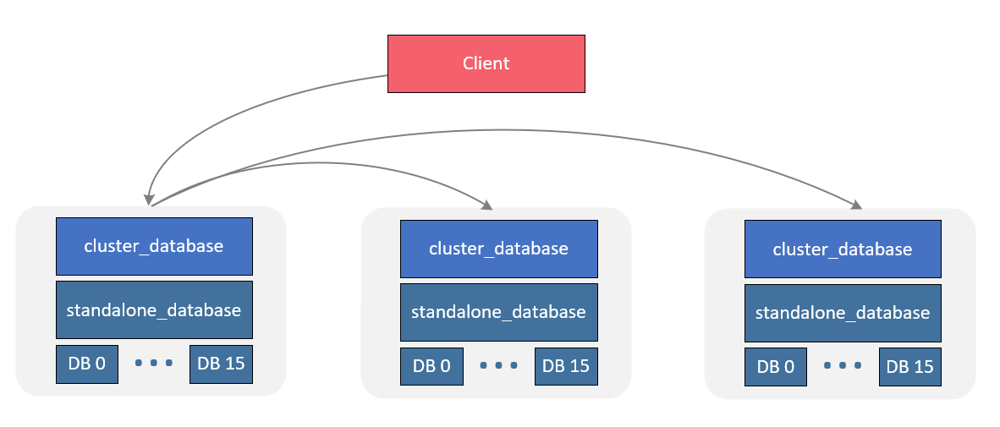

# GoRedis
使用Go重写Redis中间件
- [x] 实现Redis协议解析器
    - [x] 使用TCP Server接收客户端传递的信息，实现Redis通信协议(RESP协议)的异步解析
- [x] 实现内存数据库
    - [x] 实现KEYS命令集与STRING命令集
- [x] 实现Redis持久化
  - [x] 实现Aof落盘功能(包括指令追加到Aof文件以及从Aof文件中读取指令)
- [x] 实现简易版的Redis集群
    - [x] 实现一致性哈希、使用开源连接池进行不同节点间命令的转发
---
# 环境依赖
windows 11、Go 1.17.7、GoLand 2021.3   
开源线程池: https://github.com/jolestar/go-commons-pool v2.1.2
---
# 项目结构 
├─aof: aof持久化相关   
├─cluster: DB 集群   
├─config: 解析redis.conf配置   
├─database: 单机DB    
├─datastruct    
│  └─dict:  最底层数据结构    
├─interface: 相关接口   
│  ├─database   
│  ├─resp    
│  └─tcp   
├─lib   
│  ├─consistenthash: 一致性哈希   
│  ├─logger: 日志   
│  ├─sync   
│  │  ├─atomic: bool类型原子操作  
│  │  └─wait: sync.WaitGroup   
│  ├─utils: 工具函数   
│  └─wildcard: 通配符解析    
├─resp   
│  ├─client: 集群节点转发客户端     
│  ├─connection: 与客户端的连接   
│  ├─handler: 接收并处理RESP报文   
│  ├─parser: RESP解析器   
│  └─reply: 消息回复   
└─tcp: TCP Server
---
# 项目启动
1. go build打包两个项目, 作为集群两个从节点; 
   - 注意更改redis.conf的项目与端口号
2. 使用GoLand启动项目作为集群主节点; 启动打包完成的两个从节点; 
3. 启动 NetAssist 模拟TCP Server, 与主节点建立连接
4. 使用 NetAssist 向主节点发送若干key值不同的RESP报文, 如下：
   - *3\r\n$3\r\nSET\r\n$3\r\nkey\r\n$5\r\nvalue\r\n
   - *3\r\n$3\r\nSET\r\n$3\r\nke1\r\n$5\r\nvalue\r\n
   - *3\r\n$3\r\nSET\r\n$3\r\nke2\r\n$5\r\nvalue\r\n
   - *3\r\n$3\r\nSET\r\n$3\r\nke3\r\n$5\r\nvalue\r\n
   - *3\r\n$3\r\nSET\r\n$3\r\nke4\r\n$5\r\nvalue\r\n
5. 不同节点的appendonly.aof记录了不同key, 验证了集群转发处理功能

---
# 功能拆解
## 一、Redis协议解析器
- Resp协议样式：*3\r\n$3\r\nSET\r\n$3\r\nkey\r\n$5\r\nvalue\r\n

使用 NetAssist 模拟TCP客户端, 建立与Redis Server的连接(redis.conf中设置Redis Server的IP与端口)  

## 二、实现内存数据库
### 2.1 最底层dict接口
- datastruct/dict/dict.go
  - 数据库最底层的接口, 定义数据行为(Get(), put(), Len() 等)
- datastruct/dict/sync_dict.go
  - 数据库底层dict接口的实现 
  - 封装sync.Map, 进行键值对的存储
### 2.2 DB: Redis分数据库 
- database/db.go, dict的上层
  - makeDB(): 创建数据库, 包括
  - Exec(): 单条指令的执行
  - validateArity(): 校验参数个数是否合法
  - data Access
    - GetEntity()、PutEntity()等
- 为了提高代码的整洁性，创建哈希表 cmdTable 绑定`key: 方法名`与 `val: command 结构体`
  - database/command.go 结构体保存`具体实现方法`与`参数数量`
  - 在指令集的初始化时(如: database/string.go init()), 进行`方法名`("Get")与`command 结构体`的绑定
### 2.3 核心Database
- database/standalone_database.go
- db的上层, 整体处理流程如下:
   1. TCP Client(NetAssist) 发送RESP报文(如: *3\r\n$3\r\nSET\r\n$3\r\nkey\r\n$5\r\nvalue\r\n) 
   2. resp/handler/handler.go 接收报文并解析
      - ParseStream -> 异步调用parse0 -> 解析结果写入到某个Channel里
   3. handler 监听该Channel, 将解析后的指令发往数据库内核(StandaloneDatabase)进行处理
   4. StandaloneDatabase 调用底层的分数据库(db.go)执行具体方法
### 2.4 STRING、KEYS命令集
- 具体指令的实现
- database/string.go
  - GET、SET、SETNX、GETSET、STRLEN
- database/keys.go
  - DEL、EXISTS、FLUSHDB、TYPE、RENAME、RENAMENX
  - Redis通配符算法 lib/wildcard/wildcard
    - 如：KEYS *
## 三、实现Redis持久化
- aof/aof.go
- 落盘逻辑
  - 在执行需要记录到aof文件的指令后，调用db中的addAof()进行记录
    - 在 db.go 中添加AddAof函数 func(CmdLine)
    - AofHandler位于 StandaloneDatabase 中
    - StandaloneDatabase 初始化 AofHandler 的时候初始化db.go的AddAof方法
- db中的 addAof 实现逻辑
  1. 在 StandaloneDatabase 中初始化DB的AddAof()方法
     ```go
         DB.addAof = func(line CmdLine) {
             mdb.aofHandler.AddAof(DB.index, line)
         }
     ```
  2. AddAof(DB.index, line)的具体实现位于aof.go中，该函数将payload塞入到channel
     ```go
         handler.aofChan <- &payload{
             cmdLine: cmdLine, // 执行的命令
             dbIndex: dbIndex, // db分库序号
         }
     ```     
  3. 塞入channel中的payload, 被aof.go中的handleAof()取出; 取出后异步写入到aof文件中
## 四、实现简易版的Redis集群

- 在单机版 standalone_database的基础上创建cluster_database层, 该层负责节点之间命令的转发(类似于路由转发)
- Client连接到某个节点, 发送一个kv到cluster_database，然后cluster_database实现转发调用
  - cluster_database: 不仅要实现server功能(接收RESP报文), 还要实现client功能, 以达到命令转发的目的
    - client：resp/client
- 为了保证高并发, 维护一个连接池作为节点间转发的连接
    - go池化连接池：go-commons-pool
      - go get github.com/jolestar/go-commons-pool/v2 v2.1.2
    - cluster/client_pool.go: 连接工厂的实现
    - cluster/com.go: 连接池相关操作
- cluster_database执行逻辑
  1. 解析传入的指令
  2. 根据指令名称找到执行方式(广播、转发、本地执行)
     - cluster/router.go：指令名称和执行方式的映射关系
     - 倘若不是本地执行则计算指令key的哈希值, 根据一致性哈希方案将指令转发到对应的节点
  3. 对应的单机版standalone_database接收到RESP报文之后, 解析执行相关指令

